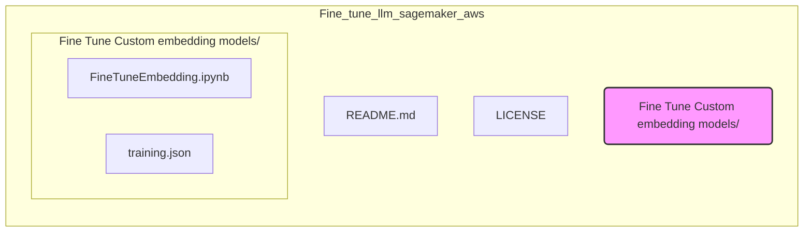

## Project Structure

- **Fine Tune Custom embedding models/**: This directory contains the code and data for fine-tuning custom embedding models.
    - **FineTuneEmbedding.ipynb**: Jupyter Notebook containing the code for fine-tuning embedding models.
    - **training.json**: JSON file likely containing the training data for fine-tuning.
- **LICENSE**:  Project license file.
- **README.md**: Project description and instructions (this file).

## Overview

The main component of this project is the `FineTuneEmbedding.ipynb` notebook. This notebook likely guides you through the process of:

1.  Preparing training data (potentially using `training.json`).
2.  Setting up a SageMaker environment.
3.  Fine-tuning a pre-trained LLM to create custom embeddings.
4.  Deploying and evaluating the fine-tuned embedding model on SageMaker.

To understand the specifics of the fine-tuning process, please refer to the `FineTuneEmbedding.ipynb` notebook.

## Getting Started

1.  **Explore the Jupyter Notebook**: Open and run `FineTuneEmbedding.ipynb` in a Jupyter environment to understand the fine-tuning process.
2.  **Review Training Data**: Examine `Fine Tune Custom embedding models/training.json` to understand the format and content of the training data.
3.  **SageMaker Setup**: Ensure you have an AWS account and SageMaker set up to run the notebook.
4.  **Follow Instructions**:  Carefully follow the instructions and code within the `FineTuneEmbedding.ipynb` notebook to fine-tune your custom embedding model.

## License

This project is licensed under the terms of the [LICENSE](LICENSE) file.
